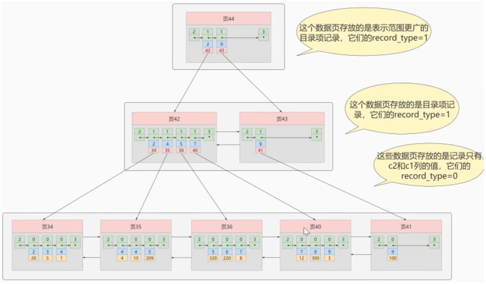

# 一、MySQL索引

## MySQL 如何实现索引机制？

三类：B+树索引、Hash索引、全文索引

## InnoDB索引和MyISAM索引实现的区别？

MyISAM索引文件和数据文件是分离的，使用B+树实现，主键索引和辅助索引实现一致，索引文件仅保存记录所在页的指针（物理地址），通过这些地址来读取页，进而读取被索引的行。

## 一个表如果没有创建索引，那么还会创建B+树吗？

会，MySQL会隐式创建基于row_id的索引。

# 二、说一下B+树索引实现原理

假设有一个表index_demo，表中有2个 INT 类型的列，1个 CHAR(1) 类型的列，c1列为主键

```mysql
CREATE TABLE index_demo(c1 INT, c2 INT, c3 CHAR(1), PRIMARY KEY(C1));
```

index_demo表的简化的行格式示意图如下：


我们只在示意图里展示记录的这几个部分：

* `record_type:` 表示记录的类型，0是普通记录、2是最小记录、3是最大记录、1是B+树非叶子节点记录。
* `next_record:` 表示下一条记录的相对位置，我们用箭头来表明下一条记录。
* `各个列的值:` 这里只记录在 index_demo 表中的三个列，分别是c1、c2 和 c3。
* `其他信息:` 除了上述三种信息以外的所有信息，包括其他隐藏列的值以及记录的额外信息。

将`其他信息`项暂时去掉并把它竖起来的效果就是这样：


`MySQL InnoDB的默认的页大小就是16KB`，因此数据存储在磁盘中，可能会占用多个数据页。


## 聚簇索引和非聚簇索引 B+ 树实现有什么区别？

**聚簇索引**

**特点：**

* `索引和数据保存在同一个B+树中`。
* `页内的记录`是按照`主键`的大小排序排成一个单向链表。
* `页与页之间`也是根据页中记录的`主键`的大小顺序排成一个`双向链表`。

* 非叶子节点存储的是记录的`主键+页号`。
* 叶子节点存储的是`完整的用户记录`。

**限制：**

* 只有InnoDB引擎支持聚簇索引，`MyISAM`不支持聚簇索引。
* 由于数据的物理存储排序方式只能有一种，所以`每个MySQL的表只能有一个聚簇索引`。
* 如果没有为表定义主键，InnoDB会选择`非空的唯一索引列替代`。如果没有这样的列，InnoDB会`隐式的定义一个主键`作为聚簇索引。
* 为了充分利用聚簇索引的聚簇特性，InnoDB中的表的`主键应选择有序的id`，不建议使用无序的id，比如UUID、MD5、HASH、字符串作为主键，无法保证数据的顺序增长。

**非聚簇索引**

(二级索引、辅助索引)

`聚簇索引`，只能在搜索条件时`主键值`时才发挥作用，因为B+树中的数据都是按照主键进行排序的，如果我们想以别的列作为搜索条件，那么需要创建`非聚簇索引`。

例如，`以c2列作为搜索条件`，那么需要使用`c2列创建一颗B+树`，如下所示：



**与聚簇索引有几处不同：**

* `页内的记录`是按照从`c2列`的大小排序排成一个`单向链表`。
* `页和页之间`也是根据页中的记录的`c2列`的大小排序排成一个`双向链表`。
* 非叶子节点存储的是记录的`c2列+页号`。
* 叶子节点存储的并不是完整的用户记录，而只是`c2列+主键`这两个列的值。

## 平衡二叉树、红黑树、B树和B+树的区别是什么？都有哪些应用场景？

## 一个B+树中大概能存放多少条索引记录？

## 使用B+树存储的索引CRUD执行效率如何？

## 什么是自适应哈希索引

自适应哈希索引是InnoDB引擎的一个特殊功能，把它注意到某些索引值被使用的非常频繁时，会在内存中基于B-Tree所有之上再创建一个哈希索引，这就让B-Tree索引也具有哈希索引的一些优点，比如快速哈希查找。这是一个完全自动的内部行为，用户无法控制或配置。

## 为什么官方建议使用自增长主键作为索引？（说一下自增主键和字符串类型主键的区别和影响）

* 自增主键能够维持底层数据顺序写入
* 读取可以由B+树的二分查找定位
* 支持范围查找，范围数据自带顺序

## 使用int自增主键后，最大id是10，删除id为10和9的字段后，再插入记录，最后添加的id是多少？删除后重启MySQL然后添加记录最后id是多少？

删除之后

* 如果重启，会从最大的id开始递增
* 如果未重启，会延续删除之前最大的id开始递增

# 三、索引的优缺点

**优点**

聚簇（主键）索引：

* 顺序读写
* 范围快速查找
* 范围查找自带顺序

非聚簇索引：

* 条件查询避免全表扫描
* 范围，排序，分组查询返回行ID，排序分组后，再回表查询完整数据，有可能利用顺序读写
* 覆盖索引不需要回表操作

## 如果是大段文本内容，如何创建（优化）索引

第一种方式是分表存储，然后创建索引

第二种使用ElasticSearch为大文本创建索引

# 四、什么是聚簇索引

## 一个表中可以有多个（非）聚簇索引吗？

聚簇索引只能有一个，非聚簇索引可以有多个

## CRUD时聚簇索引与非聚簇索引的区别是什么？

* 聚簇索引插入新值比采用非聚簇索引的速度要慢很多，因为插入要保证主键不能重复
* 聚簇索引范围，排序查找效率高，因为是有序的
* 非聚簇索引访问需要两次索引查找，第一次找主键值，第二次根据主键值找到行数据。（覆盖索引除外）

## 非聚簇索引为什么不存数据地址值而存储主键？

因为聚簇索引中有时会引发分页操作、重排操作，数据有可能会移动

# 五、什么是回表

## 非聚簇索引一定回表查询吗？

不一定，只要B+树中包含的字段（创建索引的字段），覆盖（包含）想要select的字段，那么久不会回表查询了。

## 为什么要回表查询？直接存储数据不可以吗？

为了控制非聚簇索引的大小

## 如果把一个 InnoDB 表的主键删掉，是不是就没有主键，就没办法进行回表查询了？

不是，InnoDB会生成 rowid 辅助回表查询

# 六、什么是联合索引，组合索引，复合索引

`为c2和c3列建立联合索引`，如下所示：


# 七、什么是唯一索引

## 什么时候使用唯一索引？

业务需求唯一字段的时候，一般不考虑性能问题

# 八、什么时候适合创建索引，什么时候不适合创建索引？

适合创建索引

* 频繁作为where条件语句查询字段
* 关联字段需要建立索引
* 排序字段可以建立索引
* 分组字段可以建立索引
* 统计字段可以建立索引（如 count(), max())

不适合创建索引

* 频繁更新的字段不适合创建索引
* where, 分组，排序中用不到的字段不必要创建索引
* 可以确定表数据非常少不需要建立索引
* 参与mysql函数计算的列不适合建立索引

# 九、什么是索引下推

未开启索引下推：

* 根据筛选条件在索引树中筛选第一个条件
* 获得结果集后回表操作
* 进行其他条件筛选
* 再次回表查询

开启索引下推：在条件查询时，当前索引树如果全部满足全部筛选条件，可以在当前树中完成全部筛选过滤， 得到比较小的结果集再进行回表操作。

# 十、有哪些情况下会导致索引失效？

* 计算、函数导致索引失效

  ```mysql
  EXPLAIN SELECT * FROM emp WHERE emp.name LIKE 'abc%';
  EXPLAIN SELECT * FROM emp WHERE LEFT(emp.name, 3) = 'abc'; # 索引失效
  ```

* LIKE以%, _ 开头索引失效

  ```mysql
  EXPLAIN SELECT * FROM emp WHERE emp.name LIKE '%ab%'; # 索引失效
  ```

* 不等于（!= 或者 <>）索引失效

  ```mysql
  EXPLAIN SELECT SQL_NO_CACHE * FROM emp WHERE emp.name <> 'abc'; # 索引失效
  ```

* IS NOT NULL 失效 和 IS NULL（有可能）

  **注意：**当数据库中的数据的索引列的`NULL值达到比较高的比例的时候`，即使在IS NOT NULL的情况下MYSQL的查询优化器会选择使用索引，此时`type的值是range（范围查询）`

* 类型转换导致索引失效

* 复合索引失效

* 查询优化器决定是否使得索引失效

## 为什么LIKE以%开头索引会失效？

user(id, name, age)

使用name创建索引

```mysql
SELECT * FROM user WHERE name LIKE '%明'; # type = all
SELECT name FROM user WHERE name LIKE '%明'; # type = index
```

其实并不会完全失效，覆盖索引下会出现 type = index，表示遍历了索引树，再回表查询

覆盖索引没有生效的时会直接type=all

# 十一、一个表有多个索引的时候，能否手动选择使用哪个索引？

不可用手动直接干预，只能通过mysql优化器自动选择

## 如何查看一个表的索引？

```mysql
show index from t_emp; # 显示表上的索引
explain select * from t_emp where deptid=1; # 显示可能会用到的索引及最终使用的索引
```

## 能否查看到索引选择的逻辑？是否使用过optimize_trace？

```mysql
set session optimizer_trace = "enabled=on", end_markers_in_json=on;
select * from information_schema.OPTIMIZER_TRACE;
set session optimizer_trace="enabled=off";
```

## 多个索引优先级是如何匹配的？

1. 主键（唯一索引）匹配
2. 全值匹配（单值匹配）
3. 最左前缀匹配
4. 范围匹配
5. 索引扫描
6. 全表扫描

一般性建议

* 对于单键索引，尽量选择过滤性更好的索引（例如：手机号，邮件，身份证）
* 在选择组合索引的时候，过滤性最好的字段在索引字段顺序中，位置越靠前越好
* 选择组合索引时，尽量包含where中更多字段的索引
* 组合索引出现范围查询时，尽量把这个字段放在索引次序的最后面
* 尽量避免造成索引失效的情况

# 十二、使用 Order By 时能否通过索引排序？

没有过滤条件不走索引

## 通过索引排序内部流程是什么？

关键配置：

* sort_buffer 可供排序的内存缓冲区大小
* max_length_for_sort_data 单行所有字段总和限制，超过这个大小启动双路排序

1. 通过索引过滤筛选条件所需要排序的字段+其他字段（如果是符合索引）

2. 判断所有内容是否覆盖select的字段

   1）如果覆盖索引，select的字段和排序都在索引上，那么再内存中进行排序，排序后输出结果

   2）如果索引没有覆盖查询字段，接下来计算select的字段是否超过max_length_for_sort_data限制，如果超过，启动双路排序，否则使用单路

## 什么是双路排序和单路排序

单路排序：一次取出所有字段进行排序，内存不够用的时候会使用磁盘

双路排序：取出排序字段进行排序，排序完成后再次回表查询所需要的其他字段

## Group By 分组和 Order By 在索引使用上有什么区别？

group by 使用索引的原则几乎跟order by一致，唯一区别：

* group by 先排序再分组，按照索引建的最佳左前缀法则
* group by 没有过滤条件，也可以用上索引。order by 必须有过滤条件才能使用上索引

## 如果表中有字段为null，又被经常查询该不该给这个字段创建索引？

应该创建索引，使用的时候尽量使用 is null 判断。

 # 十三、MySQL内部技术架构

## MySQL内部支持缓存查询吗？

当MySQL接收到客户端的查询SQL之后，仅仅只需要对齐进行相应的权限验证之后，就会通过Query Cache来查找结果，甚至都不需要经过Optimizer模块进行执行计划的分析优化，更不需要发生任何存储引擎的交互

MySQL5.7支持内部缓存，8.0之后就废弃掉了

### MySQL8.0之后为什么废除查询缓存？

缓存的意义在于快速查询提升系统西能，可以灵活控制缓存的一致性

mysql缓存的限制

1. mysql基本没有手段灵活的管理缓存失效和生效，尤其对于频繁更新的表
2. SQL必须完全一致才会Cache命中
3. 为了节省内存空间，太大的result set不会被cache
4. mysql缓存在分库分表环境下不起作用
5. 执行SQL里有出触发器，自定义函数时，mysql缓存也是不起作用的
6. 在表的结构和数据发生改变时，基于该表相关的cache立即全部失效

### 替代方案是什么

应用层组织缓存，最简单是使用redis, ehcached等。

## MySQL内部有哪些核心模块组成，作用是什么？


## 一条sql发送给mysql后，内部是如何执行的？(说一下MySQL执行一条查询语句的内部执行过程？)


**首先**，`MySQL客户端通过协议与MySQL服务器建立连接，通过SQL接口发送SQL语句，[先查询缓存，如果命中，直接返回结果，否则进行语句解析(对于MySQL5.7, 8.0废除了内部缓存)]`。

**接下来**，`MySQL解析器通过关键字将SQL语句进行解析，并生成一颗对应的解析树`，解析器使用MySQL语法规则验证和解析SQL语句。例如，它将验证是否使用了错误的关键字，或者使用关键字的顺序是否正确，引号能否前后匹配等;`预处理器则根据MySQL规则进一步检查解析树是否合法`，例如，这里将检查数据表和数据列是否存在，还会解析名字和别名，看是否有歧义等。`然后预处理器会进行查询重写，生成一颗新的解析树。`

**接下来**，`查询优化器将解析树转化成执行计划`。MySQL优化程序会对我们的语句做一些优化，如子查询转为连接、表达式简化等等。优化的结果就是生成一个执行计划，这个执行计划表明了应该使用哪些索引执行查询，以及表之间的连接顺序是啥样，等等。我们可以使用EXPLAIN语句来查看某个语句的执行计划。

**最后**，`进入执行器阶段`。完成查询优化后，`查询执行引擎`会按照生成的执行计划调用存储一起提供的接口执行SQL查询并将结果返回给客户端。在MySQL8一下的版本，如果设置了查询缓存，这时会讲查询结果进行缓存，再返回给客户端。


### MySQL提示“不存在此列"是执行到哪个节点报出的？

Paster:解析器 分析sql语法的时候检查的列。

### 如果一张表创建了多个索引，在哪个阶段或模块进行的索引选择？

在优化器阶段**Optimizer: 查询优化器**

## MySQL8.0存储引擎

1. InnoDB存储引擎

* InnoDB是MySQL的默认事务型引擎。它被设计用来处理大量的短期事务。可以确保事务的完整提交和回滚。
* 除非有非常特别的原因需要使用其他的存储引擎，否则应该优先考虑InnoDB引擎。
* 数据文件结构
  * 表名.frm存储表结构（MySQL8.0时，合并在表名.ibd中）
  * 表名.ibd存储数据和索引
* InnoDB不仅缓存索引还要缓存真实数据，对内存要求较高，而且内存大小对性能有决定性影响。

2. MyISM存储引擎

* MyISAM提供了大量的特性，包括全文索引、压缩、空间函数(GIS)等，但`MyISAM不支持事务和行级锁`，有一个毫无疑问的缺陷就是崩溃后无法安全恢复
* 优势是访问的速度快，对事务完整性没有要求或者以SELECT、INSERT为主的应用
* 数据文件结构
  * 表名.frm存储表结构
  * 表名.MYD存储数据
  * 表名.MYI存储索引
* MyISAM只缓存索引，不缓存真实数据

## MySQL存储引擎架构了解吗？

以下是官网的InnoDB引擎结构图，主要分为内存结构和磁盘结构两大部分。


### 能否单独为一张表设置存储引擎？

可以

`方法一：`

设置默认存储引擎：

```mysql
SET DEFAULT_STORAGE_ENGINE=MyISAM;
```

`方法二：`

或者修改 my.cnf 文件：vim /etc/my.cnf

新增一行：default-storage-engine=MyISAM

重启MySQL：systemctl restart mysqld

`方法三:`

我们可以为不同的表设置不同的存储引擎

```mysql
CREATE TABLE 表明（创建语句;) ENGINE = 存储引擎名称;
ALTER TABLE 表名 ENGINE = 存储引擎名称;
```

 ## MyISAM 和 InnoDB 的区别是什么？


# 十四、MySQL事务

## 什么是ACID?

**1、原子性A** atomicity

`只做一个步骤`

事务是数据库的逻辑工作单元，事务中包含的各操作`要么都做，要么都不做`

**2、一致性C** consistency

`保证要吃完`刚张嘴就挂了，失去一致性

事务执行的结果必须是使数据库从一个一致性状态变到另一个一致性状态。


